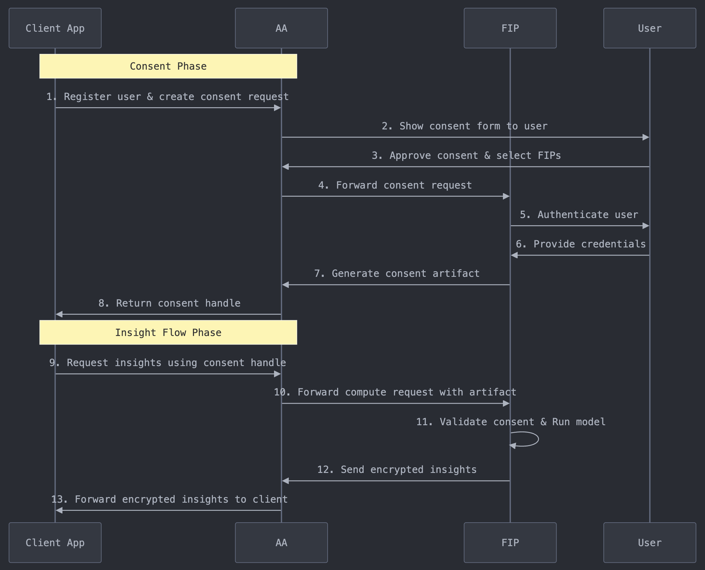

# Synapse by LattIQ
This repository contains the code and resources for **[Solution Name]**, an innovative solution that extends the Account Aggregator (AA) ecosystem by enabling secure, privacy-first intelligence sharing. The core of this solution is to empower Financial Information Users (FIUs) to harness insights from both financial and non-financial data sources through a federated learning approach. By doing so, it expands the AA ecosystem’s data reach while ensuring user data remains protected, aligning with the privacy principles set by the DPDP Act 2023.

### Key Features:
- **Data Diversity for Holistic Insights**: 
Our framework unlocks new dimensions of customer data, allowing FIUs to draw richer insights from a variety of non-financial data sources. This empowers customers by enabling a deeper, more comprehensive view of their financial health and risk profile.

- **Privacy-First Approach**: 
By prioritizing federated learning and deploying privacy-enhancing technologies (PETs), we ensure that customers' data remains within its native environment. This approach mitigates privacy risks associated with uninformed consent and minimizes data exposure.

- **Seamless Interoperability**: 
We expand the AA ecosystem's data custodianship, making it easier for diverse data providers to participate without restrictions on data types. This seamless interoperability allows customers to access financial services that better reflect their complete digital footprint.

In essence, our solution empowers customers by transforming their scattered digital activities into actionable, privacy-protected intelligence, opening new opportunities for personalized financial services and informed decision-making.

---

## Flow Sequence Diagram

Below is the sequence diagram that illustrates the flow of data and interactions within the solution. It showcases two flows:
- **Consent Flow**: Interaction between FIU AA and FIP to create and validate consent for triggering specific models
- **Insight Flow**: Interactiin between FIU AA and FIP to trigger model run and consume inferences

---

## Postman Collection

To facilitate testing, we've provided a Postman collection containing all the necessary API requests. You can download and import below collection into Postman to quickly start using the APIs.

[Download Postman Collection](https://drive.google.com/drive/folders/117EakFnYrzLqLnBA2LdmrZS01tMOXl3S?usp=drive_link)

Here's a brief on the APIs:
- **Create Consent**: (1/8) Initial request from FIU to AA to create a consent handle with all necessary parameters (UserID, Purpose, FIP, ModelIDs to be whitelisted) as well as optional parameters (model run parameters, data filters)
- **Validate Consent**: (4/7) Request from AA to FIP to validate consent after user authentication flow has been completed. Can be used to check status of consent capture
- **Request Insights**: (9) Request from FIU to AA for triggering model runs with all necessary parameters (Consent Handle, ModelID, Model configurations like runtime parameters and data filters)
- **Trigger Compute**: (10) Forwarded request from AA to FIP to trigger model run on FIP compute basis passthrough parameters
- **Access Results**: (13) Request from FIU to AA to check status of model inference and accessing final results from AA
